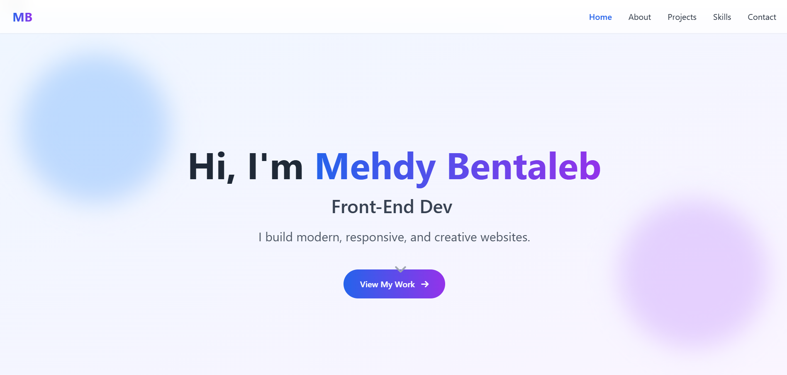
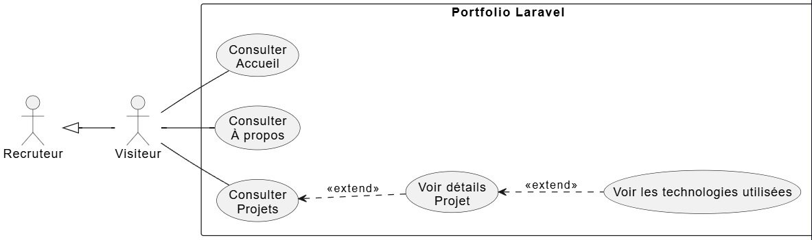
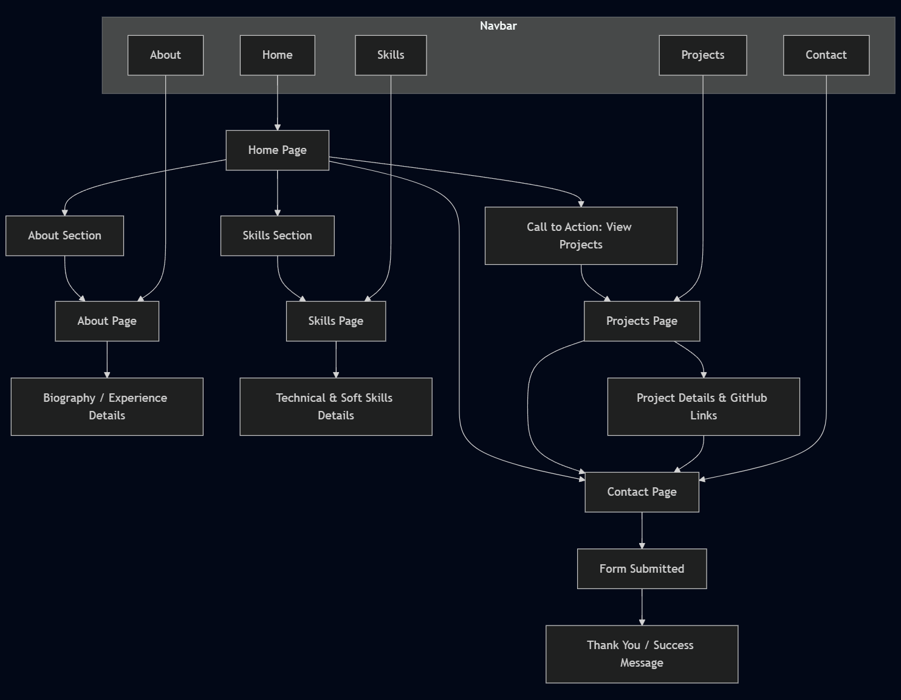
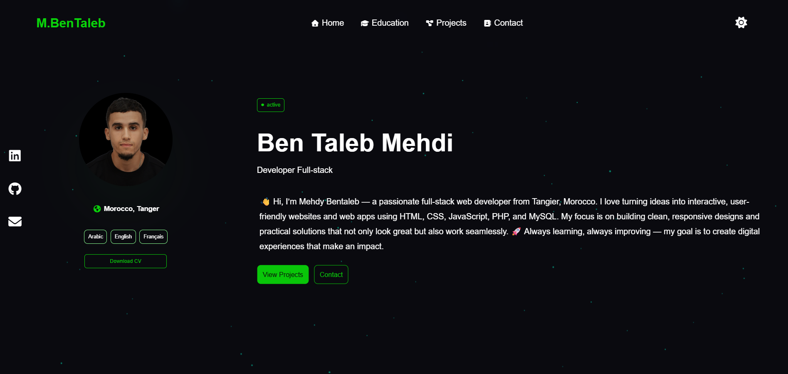

<!-- _class: lead -->

# Portfolio Developer

**By Mehdi Bentaleb**

---

## Requirements Specification

- **Client**: Mohamed Ouallou
- **Project**: Mini-site “Developer Portfolio”
- **Objective**: Showcase Profile, Projects, and Contact Information
- **Pages**:
  - Home
  - About
  - Projects
  - Contact
- **Users**:
  - Students
  - Clients
  - HR
- **Technologies**: Laravel + Services
- **Design**: Responsive & Clean

---

## Capture Portfolio

---

<!-- _class: use-case -->

## Use Case Diagram

---

## Plan

---
=======
---
marp: true
theme: default
paginate: true
title: Developer Portfolio Mini-Site Analysis
style: |
  section {
    background-color: #f5faff;
    color: #003087;
  }
  h1, h2 {
    color: #003087;
  }
  img {
    max-height: 500px;
     width: auto; 
     object-fit: contain;
  }
---

# Developer Portfolio Mini-Site
**Mallouli Abdelhay**  
*Supervised by: M. Essarraj Fouad*  
*Group: DM101*

---

## Analysis: Requirements Specification
- **Context**: Portfolio – Laravel 
- **Objective**: Profile –  Projects – Contact
- **For**: Aboumacha Mohamed Amine
- **Users**: Recruiters – Clients – Students
- **Pages**: Home – Projects – Details – About
- **Design**: Clean – Responsive – blue and white for colors

---

## Analysis: Example of an Inspiring Site

---

## Analysis: Use Case Diagram

---

## Conception: Schema

---

## Conception: Maquette

